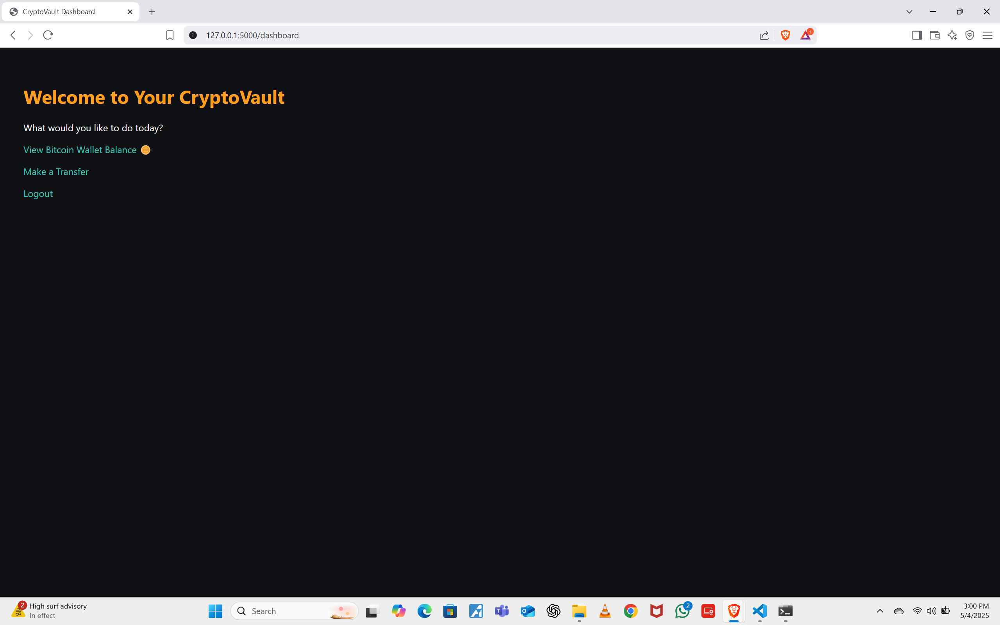
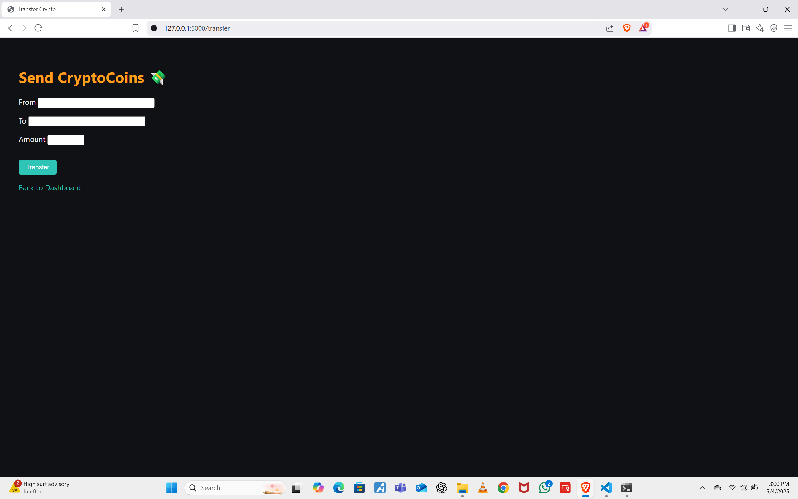
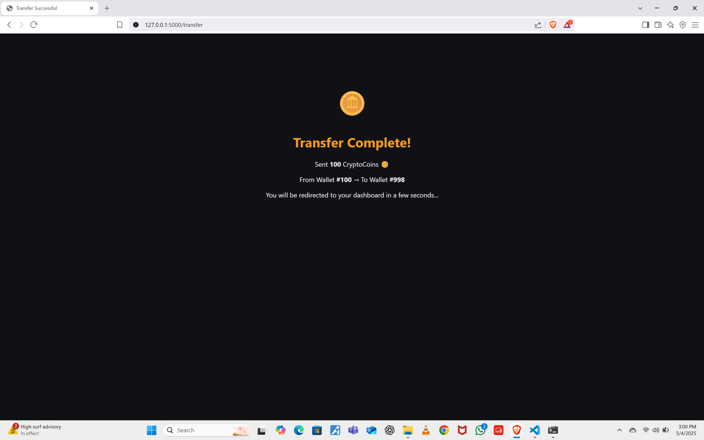

# 🪙 CryptoVault – A Secure Crypto Wallet Web App

CryptoVault is a Flask-based web application that simulates a secure cryptocurrency wallet platform. Built with best practices in web security, it allows users to manage wallets, check balances, and transfer CryptoCoins to others — all while defending against common web vulnerabilities.



---

## 🚀 Features

- 🛡️ **Secure Authentication** with PBKDF2-hashed passwords
- 🪙 **Crypto-themed UI** for a fun experience
- 💸 **Transfer System** with live validation and animated success screen
- ✅ **CSRF & XSS Protection** via Flask-WTF and template escaping
- 🔒 **User Enumeration Defense** (generic error messages)
- 🧠 **Input Validation** for all form submissions
- 🌐 **JWT-based session handling** (with HTTP-only cookies)
- 🎨 **Minimal CSS styling** and animations (floating coins!)
- 📜 **Extensive inline comments** explaining all security decisions

---

## 📦 Tech Stack

- Python 3.x
- Flask + Flask-WTF
- SQLite3
- WTForms
- Passlib (PBKDF2 hashing)
- PyJWT (for token signing)

---

## 🛠️ Setup Instructions

1. **Clone the repo:**
   ```bash
   git clone https://github.com/Vraj08/cryptovault.git
   cd cryptovault
   ```

2. **Create a virtual environment (recommended):**
   ```bash
   python -m venv env
   source env/bin/activate  # or env\Scripts\activate on Windows
   ```

3. **Install dependencies:**
   ```bash
   pip install -r requirements.txt
   ```

4. **Initialize the database:**
   ```bash
   python bin/createdb.py
   python bin/makeaccounts.py
   ```

5. **Run the app:**
   ```bash
   flask run
   ```

6. **Access:**
   Visit [http://localhost:5000](http://localhost:5000)

---

## 🔐 Security Highlights

| Threat | Defense |
|--------|---------|
| **SQL Injection** | Parameterized queries (`?`) used throughout |
| **XSS (Cross-Site Scripting)** | Jinja2 autoescaping enabled in all templates |
| **CSRF (Cross-Site Request Forgery)** | Flask-WTF's built-in CSRF token |
| **Timing Attacks** | Password comparison uses `compare_digest()` |
| **Weak Passwords** | Enforced length ≥ 8 characters |
| **User Enumeration** | Login errors always say “Invalid credentials” |
| **JWT Hijacking** | Token stored in HTTP-only cookie |

---

## 🧪 Example Accounts

- `alice@example.com` / `123456`
- `bob@example.com` / `123456`

*(Passwords are securely hashed in the DB.)*

---

## 🎨 UI Styling

- Dark-themed layout using custom `styles.css`
- CryptoCoin floating animation on balance displays
- Color-coded buttons and form errors

---

## 👥 Team Members

> Developed with love and security in mind ❤️

- **Vraj Patel**
- **Divy Patel**
- **Ayush Prabhakar**

---
## 📷 Screenshots

### 🧭 Dashboard


### 💸 Transfer


### ✅ Confirmation


### ❌ Login Error
.png)

### 🔐 Login Page
.png)

### ⚠️ Transfer Error
.png)

### 📉 Amount Too High
.png)

### 🔁 Transfer Valid


### 👛 Wallet Details
.png)


---

## 📝 License

MIT License © 2025 CryptoVault Devs
